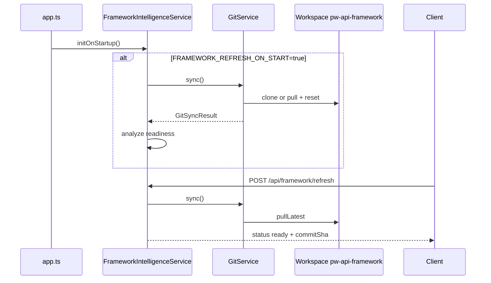
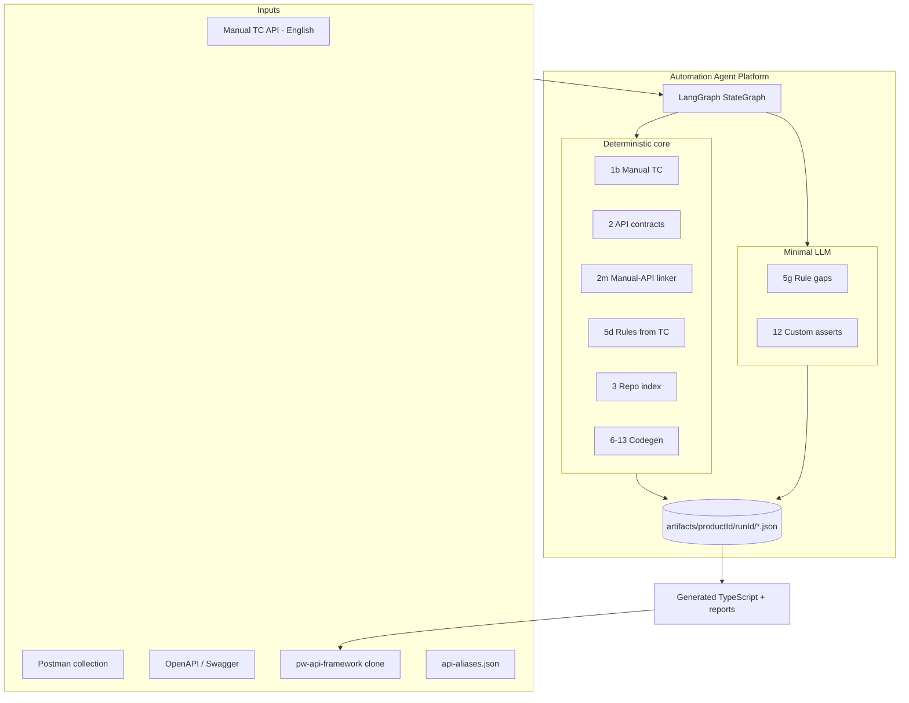
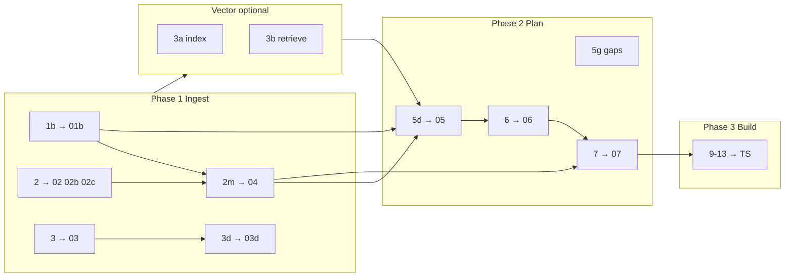
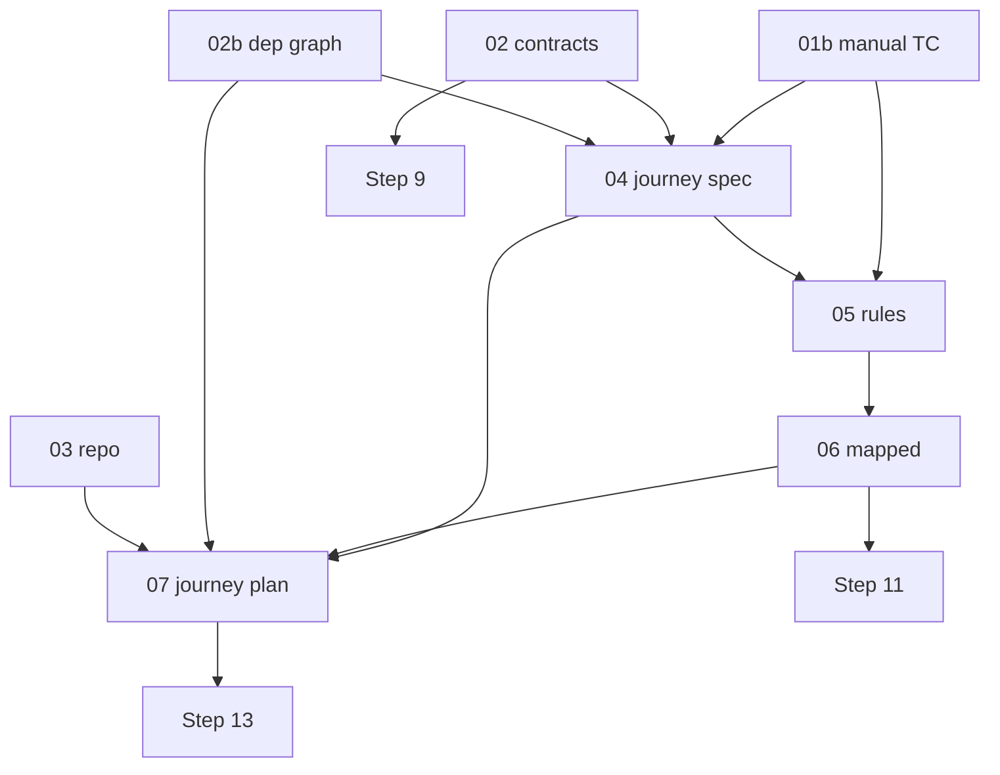
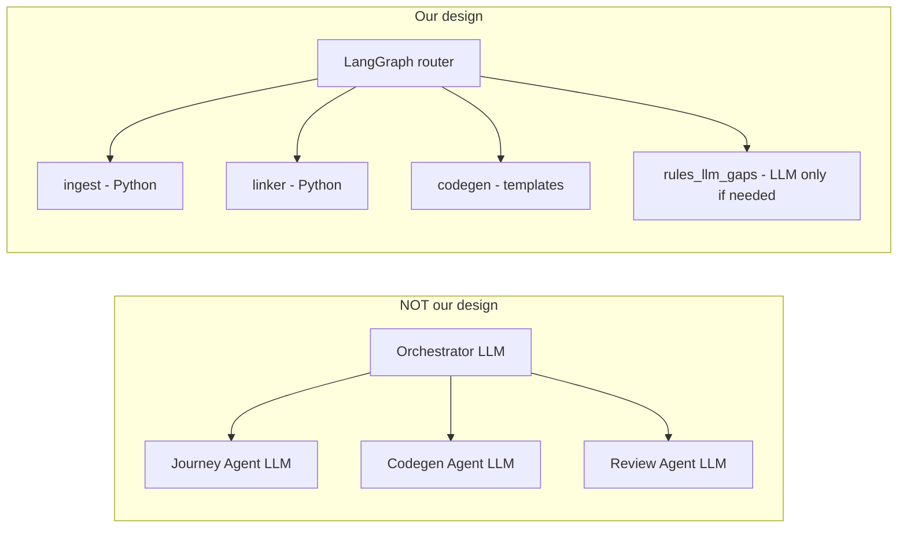
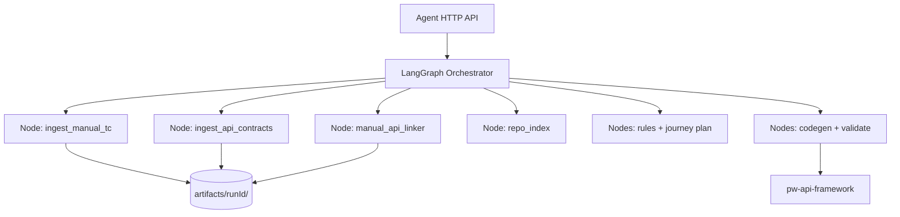
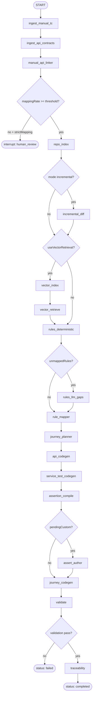
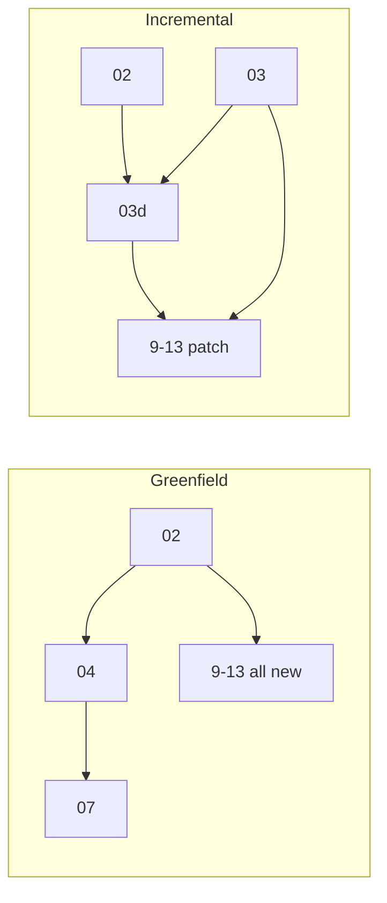

# AI Automation Agent — Low-Level Design (LLD)

**Version:** 3.2  
**Repository (codegen target):** pw-api-framework  
**Platform (service under build):** automation-agent (Node.js + Fastify)  
**Audience:** Backend engineers, platform architects, automation leads  
**Companion:** [`AUTOMATION_AGENT_OVERVIEW.md`](./AUTOMATION_AGENT_OVERVIEW.md)  
**Build guide (Cursor / phased implementation):** [`AUTOMATION_AGENT_BUILD_PROMPT.md`](./AUTOMATION_AGENT_BUILD_PROMPT.md)

**Design thesis:** An **intelligent automation engineering platform** — not a prompt wrapper or multi-agent system. Intelligence lives in **parsers, dependency graphs, deterministic manual↔API linking, rule engines, and template compilers**. LLM is used only for **gaps** (unparsed English rules, custom asserts). TypeScript is **never** written by LLM in bulk.

**v3.0 change:** **Product docs / PRD removed** from the pipeline. **Manual test cases** + **Postman/OpenAPI** are primary inputs. **Step 2m** deterministically maps English manual steps → `apiId` (target ≥95% with curated aliases).

**v3.1 change:** Pipeline execution is orchestrated by **LangGraph** (single `StateGraph`, not a multi-agent LLM swarm).

**v3.2 change:** **Framework Git sync** connects the platform to the automation repo before pipeline runs. Platform service follows **monolithic modular** layout with **SOLID** boundaries for future scale (rate limiting, Kafka, queues).

---

## Table of contents

0. [Platform service architecture](#0-platform-service-architecture)
0.1. [Framework repository connection (Git sync)](#01-framework-repository-connection-git-sync)  
**Implementation:** use [`AUTOMATION_AGENT_BUILD_PROMPT.md`](./AUTOMATION_AGENT_BUILD_PROMPT.md) for layers, phases, and Cursor sessions — not this file alone.
1. [System boundary & objectives](#1-system-boundary--objectives)
2. [Inputs (no PRD)](#2-inputs-no-prd)
3. [Pipeline overview](#3-pipeline-overview)
4. [LangGraph orchestrator](#4-langgraph-orchestrator)
5. [Artifact catalog — every file](#5-artifact-catalog--every-file)
6. [Step 2m — Manual TC ↔ API linker](#6-step-2m--manual-tc--api-linker)
7. [Target framework outputs (7 layers)](#7-target-framework-outputs-7-layers)
8. [Product modes: greenfield vs incremental](#8-product-modes-greenfield-vs-incremental)
9. [Assertion strategy (4 layers)](#9-assertion-strategy-4-layers)
10. [Planning artifacts: 04, 05, 06, 07](#10-planning-artifacts-04-05-06-07)
11. [Vector DB (slim)](#11-vector-db-slim)
12. [LLM vs deterministic boundary](#12-llm-vs-deterministic-boundary)
13. [Caching keys](#13-caching-keys)
14. [Codegen steps 8–18](#14-codegen-steps-818)
15. [Validation & traceability](#15-validation--traceability)
16. [Deployment topology](#16-deployment-topology)
17. [Accuracy & quality gates](#17-accuracy--quality-gates)
18. [MVP implementation order](#18-mvp-implementation-order)
19. [Reference patterns in this repo](#19-reference-patterns-in-this-repo)
20. [Appendix — example files](#20-appendix--example-files)
21. [Phase-wise execution & acceptance gates](#21-phase-wise-execution--acceptance-gates)

---

## 0. Platform service architecture

This section describes the **automation-agent** application (Fastify service), separate from the **pw-api-framework** repository that receives generated tests.

### 0.1 Two-repository model

| Repository | Role |
|------------|------|
| **automation-agent** | Platform service: APIs, orchestration, parsers, codegen engine, Git sync |
| **pw-api-framework** | Target automation codebase: models, services, integration tests (synced into workspace) |

Pipeline `repoRoot` for Step 3 and codegen points at the **synced workspace copy** of pw-api-framework, not a random local path.

### 0.2 Application style: monolithic modular

Single deployable **monolith** with **modular packages** inside one codebase.

| Principle | How we apply it |
|-----------|-----------------|
| **Single Responsibility** | Each service class has one job (`GitService` = sync only, `FrameworkIntelligenceService` = refresh + analyze orchestration) |
| **Open/Closed** | Add Kafka or rate limiting via new modules/middleware without changing pipeline core |
| **Liskov Substitution** | Interfaces for Git, artifact store, LLM client, event bus (stub in V1) |
| **Interface Segregation** | Small ports: `IGitSync`, `IRepoAnalyzer`, `IRunRepository`, not one god interface |
| **Dependency Inversion** | Routes and orchestrator depend on interfaces; wire implementations in composition root (`app.ts`) |

### 0.3 Recommended platform layout (Fastify + TypeScript)

```
automation-agent/
├── src/
│   ├── app.ts                              # bootstrap, DI wiring, startup hooks
│   ├── config/
│   │   └── framework.config.ts             # FRAMEWORK_* env config
│   ├── routes/
│   │   ├── framework.route.ts              # GET status, POST refresh
│   │   └── runs.route.ts                   # POST /runs, GET /runs/:id (future)
│   ├── services/
│   │   ├── git/
│   │   │   └── git.service.ts              # clone, pull, PAT injection
│   │   └── framework-intelligence/
│   │       └── frameworkIntelligence.service.ts
│   ├── orchestrator/                       # LangGraph graph + nodes
│   ├── pipelines/                            # ingest, linker, rules, planner, codegen
│   ├── contracts/                            # JSON schemas per artifact
│   └── plugins/                              # future: rate-limit, kafka, metrics
├── .env.example
└── tests/
```

### 0.4 Future scalability hooks (design now, implement later)

| Capability | V1 | Future module |
|------------|-----|----------------|
| HTTP API | Fastify routes | same |
| Rate limiting | optional middleware stub | `plugins/rate-limit` |
| Async runs | sync invoke or in-process queue | Kafka consumer + job table |
| Observability | structured logs per `runId` | metrics + tracing exporter |
| Multi-instance | single instance OK | shared artifact store + distributed locks |

Rules for future additions:

- no business logic inside route handlers
- no direct Git calls from pipeline nodes (always via `GitService`)
- pipeline nodes remain stateless; state lives in artifacts + checkpointer

---

## 0.1 Framework repository connection (Git sync)

**Phase P0 (platform bootstrap).** Must complete before a generation run can use repo intelligence (`03`, codegen).

### 0.1.1 Purpose

Keep a local workspace copy of **pw-api-framework** aligned with `origin/<branch>` so:

- Step 3 (repo index) scans consistent code
- incremental diff (`03d`) compares against real framework state
- codegen writes to a known directory tree

### 0.1.2 Configuration

**File:** `src/config/framework.config.ts`

| Environment variable | Required | Default | Purpose |
|---------------------|----------|---------|---------|
| `FRAMEWORK_GIT_URL` | Yes | — | Remote URL of pw-api-framework |
| `FRAMEWORK_BRANCH` | No | `main` | Branch to track |
| `FRAMEWORK_WORKSPACE_DIR` | No | `.framework` | Local clone directory |
| `FRAMEWORK_GIT_TOKEN` | No | — | PAT for private HTTPS repos |
| `FRAMEWORK_REFRESH_ON_START` | No | `false` | Auto sync on app boot |

**Example `.env` block:**

```env
FRAMEWORK_GIT_URL=https://github.com/your-org/pw-api-framework.git
FRAMEWORK_BRANCH=main
FRAMEWORK_WORKSPACE_DIR=./workspace/framework
FRAMEWORK_GIT_TOKEN=ghp_xxxxxxxx
FRAMEWORK_REFRESH_ON_START=true
```

### 0.1.3 Git service behavior

**File:** `src/services/git/git.service.ts`

**Method `sync()`:**

1. If workspace has no `.git` directory: `ensureCloned()` (initial clone into `FRAMEWORK_WORKSPACE_DIR`)
2. Else: `pullLatest()` (fetch, checkout branch, hard reset to `origin/<branch>`)

**Authentication (V1):**

- Public repos: URL as-is
- Private HTTPS repos: inject `FRAMEWORK_GIT_TOKEN` into remote URL
- One auth strategy per deployment; V1 supports PAT and public only

**Interface (SOLID):**

```typescript
export interface IGitService {
  sync(): Promise<GitSyncResult>;
  getStatus(): Promise<GitWorkspaceStatus>;
}
```

**`GitSyncResult` (example):**

```json
{
  "action": "clone | pull",
  "branch": "main",
  "commitSha": "f3a8b2c1",
  "workspaceDir": "./workspace/framework",
  "syncedAt": "2026-05-28T10:00:00Z",
  "success": true
}
```

### 0.1.4 Framework intelligence orchestration

**File:** `src/services/framework-intelligence/frameworkIntelligence.service.ts`

| Method | Behavior |
|--------|----------|
| `initOnStartup()` | Called from `app.ts` after boot; if `FRAMEWORK_REFRESH_ON_START=true`, triggers sync |
| `runRefresh()` | Calls `gitService.sync()`, then runs lightweight analysis on synced tree (readiness for `03`) |
| `getStatus()` | Returns connection state, last sync, commit SHA, errors |

Does **not** run full pipeline; only ensures framework workspace is fresh and reportable.

### 0.1.5 HTTP API

**File:** `src/routes/framework.route.ts`

| Method | Path | Purpose |
|--------|------|---------|
| POST | `/api/framework/refresh` | Force Git sync + framework analysis |
| GET | `/api/framework/status` | Workspace readiness, last sync, commit, errors |

### 0.1.6 Startup sequence

**File:** `src/app.ts`

```
1. Load config (framework.config.ts + env)
2. Register routes and services (DI)
3. await frameworkIntelligence.initOnStartup()
4. Listen on HTTP port
```

If refresh on start is enabled, first pipeline run can assume workspace exists without manual refresh.

### 0.1.7 Connection to pipeline Step 3

After Phase P0:

```json
{
  "runRequest": {
    "repoRoot": "<FRAMEWORK_WORKSPACE_DIR resolved absolute path>",
    "productId": "bbps/ccbp"
  }
}
```

Step 3 (`03-repo-index.json`) scans `repoRoot`. LangGraph node `repo_index` must fail fast if framework status is not `ready`.

### 0.1.8 Phase P0 acceptance criteria

- Clone works on clean machine
- Pull works on existing workspace
- Private repo works with PAT
- GET `/api/framework/status` returns `ready: true` after successful sync
- POST `/api/framework/refresh` updates commit SHA and timestamp
- `repoRoot` used by Step 3 matches synced workspace path
- No pipeline node calls Git directly (only `GitService`)

**Vector DB involved:** No

### 0.1.9 Phase P0 flow diagram



---

## 1. System boundary & objectives

### 1.1 Boundary diagram



### 1.2 Generation objectives

| Output type | Description |
|-------------|-------------|
| **API-wise automation** | `src/models`, `src/schemas`, `src/services`, `tests/service/**` |
| **Journey automation** | `tests/integration/**` — steps, journey, assertions, spec, helpers |

### 1.3 Non-goals

- LLM writing full `*.spec.ts` or `*Service.ts` bodies
- Multiple **LLM agents** debating in parallel (LangGraph is a **workflow** orchestrator, not a multi-agent reasoning swarm)
- Sending entire repo / full Postman / full OpenAPI to the model
- **Product doc / Confluence / PRD** as a required input (removed in v3.0)
- Vector search for exact symbol lookup (use AST `03`)

### 1.4 Removed in v3.0 (vs v2.0)

| Removed | Replaced by |
|---------|-------------|
| Step 1 → `01-raw-sections.json` | — |
| Step 4 (LLM) → `04-product-spec.json` | **Step 2m** → `04-journey-spec.json` |
| `docHash` cache | **`manualTcHash`** cache |
| Vector `doc_chunks` | Dropped |

---

## 2. Inputs (no PRD)

### 2.1 Run request

```json
{
  "productId": "bbps/ccbp",
  "repoRoot": "/path/to/pw-api-framework",
  "mode": "greenfield | incremental",
  "llmProfile": "minimal | standard | full",
  "env": "qa",
  "enabledJourneys": ["ccbp_new_user_bill_discovery"],
  "useVectorRetrieval": true,
  "strictMapping": true,
  "mappingThreshold": 0.95,
  "inputs": {
    "postmanCollection": {},
    "openApiSpecs": [{ "path": "specs/bbps-ccbp.openapi.json", "format": "openapi3" }],
    "manualTestCases": {
      "fetchFromPlatform": true,
      "filters": { "productId": "bbps/ccbp" }
    }
  }
}
```

### 2.2 Input sources (four required + one recommended)

| # | Source | Step | Primary artifacts |
|---|--------|------|-------------------|
| 1 | **Manual test cases API** | 1b | `01b-manual-test-cases.json` |
| 2 | **Postman collection** | 2 | `02-api-contracts.json`, `02b-dependency-graph.json` |
| 3 | **OpenAPI / Swagger** | 2 | Merged into `02`, `02c-schema-index.json` |
| 4 | **Existing repo** | 3 | `03-repo-index.json` |
| 5 | **`api-aliases.json`** (recommended) | 2m | Curated phrases → `apiId` (≥95% mapping) |

**Path precedence (codegen):** Postman path + method > OpenAPI path.

---

## 3. Pipeline overview

### 3.1 Master flow



### 3.2 Step table

| Step | Name | LLM | Output file(s) |
|------|------|-----|----------------|
| **1b** | Manual TC ingest | No | `01b-manual-test-cases.json` |
| **2** | API contract + graph | No | `02`, `02b`, `02c` |
| **2m** | Manual TC ↔ API linker | **No** | **`04-journey-spec.json`** |
| **3** | Repo index (AST) | No | `03-repo-index.json` |
| **3d** | Incremental diff | No | `03d-incremental-diff.json` (incremental only) |
| **3a** | Vector index | No | `03a-index-report.json` |
| **3b** | Vector retrieve | No | `03b-retrieval-step{N}.json` |
| **5d** | Business rules (deterministic) | No | `05-business-rules.json` |
| **5g** | Business rules (gaps) | Yes* | patches `05` |
| **6** | Rule mapper | Optional | `06-business-rules-mapped.json` |
| **7** | Journey planner | **Mostly no**† | `07-journey-plan.json` |
| **8** | API linker | No / skip | optional `08-api-links.json` |
| **9** | API codegen | No | models, services, schemas |
| **10** | Service test codegen | No | `tests/service/**` |
| **11** | Assertion compile | No | `assertions.ts` |
| **12** | Assert author | Yes‡ | custom assert snippets |
| **13** | Journey codegen | No | steps, journey, spec |
| **14–18** | Config, validate, approve | Human | reports, `rules.approved.json` |

\* Only if `05.unmappedRules[]` non-empty  
† Deterministic compiler from `04`+`03`+`02b`+`06`; optional LLM polish  
‡ Only for `06.pendingCustom[]`

### 3.3 Data dependency diagram



---

## 4. LangGraph orchestrator

The pipeline is executed by a **LangGraph `StateGraph`**. This is **workflow orchestration** (run steps in order, branch on flags, cache, failures) — **not** multiple autonomous LLM agents talking to each other.

| LangGraph is | LangGraph is not |
|--------------|------------------|
| A **DAG / state machine** over pipeline steps | A “crew” of planner/coder/reviewer agents |
| Nodes = **pure Python functions** (ingest, 2m, codegen) | Every node calling LLM |
| Conditional edges on `mode`, cache, `mappingRate` | Open-ended agent loops |
| **Checkpointing** for human approve (Step 18) | Recursive self-correction chains |

### 4.0 “Orchestrator” ≠ “multiple agents” (read this first)

People often hear **orchestrator** and imagine: *Orchestrator decides whether to call **Journey Agent**, **API Agent**, or **Assert Agent** — each a separate LLM with its own role.*

**That is NOT this design.**

| Multi-agent pattern (we do **not** use) | This design (LangGraph **workflow**) |
|---------------------------------------|--------------------------------------|
| Journey Agent (LLM) plans flow | `manual_api_linker` node — **Python**, no LLM |
| API Agent (LLM) writes services | `api_codegen` node — **templates**, no LLM |
| Assert Agent (LLM) writes tests | `assertion_compile` node — **catalog**, no LLM |
| Orchestrator **picks which agent** to invoke | Graph **picks which step function** to run next |
| Many LLM calls across “roles” | **2–3 LLM nodes total** (`rules_llm_gaps`, `assert_author`) |

**What the orchestrator actually decides** (conditional edges — all **if/else**, not “which AI agent”):

| Decision | Example | Type |
|----------|---------|------|
| Run incremental diff? | `mode == incremental` → node `incremental_diff` | Rule |
| Mapping good enough? | `mapping_rate >= 0.95` → continue else `interrupt` | Rule |
| Need vector retrieval? | `use_vector_retrieval` → nodes `3a`, `3b` | Rule |
| Any unparsed rules? | `unmapped_rules` → node `rules_llm_gaps` | Rule |
| Any custom asserts? | `pending_custom` → node `assert_author` | Rule |

**Rename mentally:** LangGraph **node** = **pipeline step** (like a CI job), not an **LLM agent**.



### 4.1 Placement in architecture



**Package layout (agent service repo, not pw-api-framework):**

```
automation-agent/
├── orchestrator/
│   ├── graph.py           # StateGraph build + compile
│   ├── state.py           # AgentRunState TypedDict
│   ├── nodes/             # one module per pipeline step
│   │   ├── ingest.py      # 1b, 2
│   │   ├── linker.py      # 2m
│   │   ├── repo.py        # 3, 3d
│   │   ├── vector.py      # 3a, 3b
│   │   ├── rules.py       # 5d, 5g, 6
│   │   ├── journey.py     # 7
│   │   └── codegen.py     # 9-15, 17
│   └── routing.py         # conditional edge functions
├── pipelines/             # step implementations (call parsers/codegen)
└── api/                   # POST /runs → graph.invoke()
```

### 4.2 Graph state (`AgentRunState`)

Single shared state passed between nodes. Persist artifact paths, not full file bodies.

```python
class AgentRunState(TypedDict, total=False):
    # Run identity
    run_id: str
    product_id: str
    mode: Literal["greenfield", "incremental"]
    llm_profile: Literal["minimal", "standard", "full"]
    env: str
    enabled_journeys: list[str]
    use_vector_retrieval: bool
    strict_mapping: bool
    mapping_threshold: float  # default 0.95

    artifacts_dir: str

    # Input handles (paths or fetched blobs)
    postman_path: str
    openapi_paths: list[str]
    manual_tc_fetched: bool

    # Artifact paths (written by nodes)
    path_01b: str
    path_02: str
    path_02b: str
    path_02c: str
    path_03: str
    path_03d: str | None
    path_04: str
    path_05: str
    path_06: str
    path_07: str

    # Cache flags
    manual_tc_hash: str
    postman_hash: str
    openapi_hash: str
    repo_commit_sha: str
    cache_hit_05: bool

    # Metrics / gates
    mapping_rate: float
    llm_calls: int
    tokens_in: int
    tokens_out: int

    # Control
    status: Literal["running", "paused", "failed", "completed"]
    error: str | None
    unmapped_steps: list[dict]  # from 04.unmapped
    pending_custom_rules: list[str]
```

### 4.3 Nodes (1:1 with pipeline steps)

Each node: **read state → run step impl → write artifacts → update state → return state**.

| LangGraph node | Pipeline step | LLM? |
|----------------|---------------|------|
| `ingest_manual_tc` | 1b | No |
| `ingest_api_contracts` | 2 | No |
| `manual_api_linker` | 2m | No |
| `repo_index` | 3 | No |
| `incremental_diff` | 3d | No |
| `vector_index` | 3a | No |
| `vector_retrieve` | 3b | No |
| `rules_deterministic` | 5d | No |
| `rules_llm_gaps` | 5g | Yes |
| `rule_mapper` | 6 | Optional |
| `journey_planner` | 7 | Rare |
| `api_codegen` | 9 | No |
| `service_test_codegen` | 10 | No |
| `assertion_compile` | 11 | No |
| `assert_author` | 12 | Yes |
| `journey_codegen` | 13 | No |
| `validate` | 15 | No |
| `traceability` | 17 | No |

Nodes **not** in default graph: Step 8 (merged into 2m), Step 16 (optional `full` profile subgraph).

### 4.4 Graph flow (mermaid)



### 4.5 Conditional edges (routing rules)

| Router | Condition | Next |
|--------|-----------|------|
| `after_linker` | `mapping_rate >= mapping_threshold` | `repo_index` |
| `after_linker` | else + `strict_mapping` | **`interrupt`** → human fixes `api-aliases` / manual TC |
| `after_repo` | `mode == incremental` | `incremental_diff` |
| `after_repo` | else | skip `3d` |
| `after_rules_det` | `len(unmapped_rules) > 0` | `rules_llm_gaps` |
| `after_assert_compile` | `len(pending_custom) > 0` | `assert_author` |
| `after_validate` | `validation_status == fail` | `END` with error |

### 4.6 Caching inside the graph

Before expensive nodes, routing checks cache:

```python
def route_after_manual_tc(state: AgentRunState) -> str:
    if cache.exists(state["manual_tc_hash"], "04"):
        state["path_04"] = cache.path(...)
        return "skip_to_repo_index"  # or reload 04 into state
    return "manual_api_linker"
```

| Cache key | Skip nodes |
|-----------|------------|
| `manual_tc_hash` | `rules_llm_gaps` if `05` cached |
| `postman_hash` + `openapi_hash` | `ingest_api_contracts` if `02` cached |
| `repo_commit_sha` | `repo_index` if `03` cached |

### 4.7 Human-in-the-loop (Step 18)

Use LangGraph **`interrupt`** after failed mapping or before merge to main:

1. Graph pauses with `status: paused` and `04.unmapped[]` in state.
2. Human updates `api-aliases.json` or manual TC platform.
3. **`graph.invoke` / `Command(resume=...)`** resumes from `manual_api_linker` or approval node.
4. On approve → write `rules.approved.json` → trigger `vector_index` subgraph.

```python
from langgraph.types import interrupt

def manual_api_linker(state: AgentRunState) -> AgentRunState:
    result = run_step_2m(state)
    if result["mapping_rate"] < state["mapping_threshold"] and state["strict_mapping"]:
        interrupt({"reason": "mapping_below_threshold", "unmapped": result["unmapped"]})
    return {**state, **result}
```

### 4.8 API entrypoint

```python
# POST /v1/runs
def create_run(body: RunRequest) -> RunResponse:
    graph = build_automation_graph(checkpointer=postgres_checkpointer)
    config = {"configurable": {"thread_id": body.run_id}}
    final = graph.invoke(initial_state_from(body), config=config)
    return RunResponse.from_state(final)
```

| Endpoint | Action |
|----------|--------|
| `POST /v1/runs` | Start graph (`invoke`) |
| `GET /v1/runs/{id}` | Read state + artifact paths |
| `POST /v1/runs/{id}/resume` | After human fix / approve |
| `POST /v1/runs/{id}/cancel` | Cancel running thread |

### 4.9 Why LangGraph (vs plain code)

| Benefit | For this pipeline |
|---------|-------------------|
| **Visible DAG** | 20 steps, many branches — graph is self-documenting |
| **Checkpoint / resume** | Mapping fail → fix aliases → resume without re-running Postman parse |
| **Parallel fan-out** (optional) | `api_codegen` ∥ `service_test_codegen` after `06` |
| **Observability** | LangSmith traces per node (latency, errors) |
| **Same process** | Still one worker; not microservices per step |

### 4.10 What stays outside LangGraph

| Concern | Where |
|---------|--------|
| Parsers (Postman, OpenAPI, AST) | `pipelines/` libraries called by nodes |
| Template codegen | `pipelines/codegen/` called by nodes |
| Vector DB client | `pipelines/vector/` called by 3a/3b nodes |
| pw-api-framework files | Written to `repoRoot` by codegen nodes |

---

## 5. Artifact catalog — every file

All paths: **`artifacts/{productId}/{runId}/`**

---

### `01b-manual-test-cases.json` — Step 1b

| | |
|--|--|
| **How** | HTTP to manual TC platform → normalize; parse `expectedResults` → `assertionHints` |
| **Why** | Source of truth for journeys, English steps, business expectations |
| **LLM** | No |

**Structure:**

| Field | Purpose |
|-------|---------|
| `manualTcHash` | Cache key (SHA-256 of normalized cases) |
| `cases[].caseId` | Stable id |
| `cases[].persona` | new_user, existing_user, … |
| `cases[].journeyTags[]` | Group into journeys |
| `cases[].steps[]` | English step text |
| `cases[].expectedResults[]` | Business state text |
| `cases[].assertionHints[]` | `{ path, op, value }` when structured |

**Example:**

```json
{
  "productId": "bbps/ccbp",
  "manualTcHash": "sha256:abc123...",
  "cases": [{
    "caseId": "MTC-1042",
    "title": "New user — empty bureau bills",
    "persona": "new_user",
    "journeyTags": ["bill_discovery"],
    "steps": ["Login with new mobile", "Open CC section", "Verify bureau bills empty"],
    "expectedResults": ["cards=[]", "bureau bills empty"],
    "assertionHints": [{
      "path": "bureau.data.bureauBills",
      "op": "length",
      "value": 0
    }]
  }]
}
```

**Used by:** 2m, 5d, 5g, 11, 17, 3a (`manual_tc`)

---

### `02-api-contracts.json` — Step 2

| | |
|--|--|
| **How** | Parse Postman; merge OpenAPI by path+method |
| **Why** | Single contract per API for services, mapping, tests |

**Merge rules:**

| Field | Winner |
|-------|--------|
| `path`, `method`, `samples` | Postman |
| `requestRequired`, `enums`, schema refs | OpenAPI |
| `responseFields` | Union(Postman example keys, OpenAPI properties) |

**Example (merged row):**

```json
{
  "apiId": "ccbp.bill_fetch",
  "method": "POST",
  "path": "/bbps/v1/billDesk/bbps/bill-fetch",
  "auth": "bearer",
  "requestSchemaRef": "BillFetchRequest",
  "responseSchemaRef": "BillFetchResponse",
  "requestRequired": ["billerId", "authenticators"],
  "responseFields": ["validation_id", "bill_amount", "bill_status"],
  "samples": { "200": { "validation_id": "val_9f2a", "bill_amount": 15420.5 } }
}
```

---

### `02b-dependency-graph.json` — Step 2

| | |
|--|--|
| **How** | Postman `{{var}}`, auth headers, test scripts; topological sort |
| **Why** | Valid API order; `writes` for journey plan |

```json
{
  "edges": [{
    "from": "auth.verify_otp",
    "to": "ccbp.bill_fetch",
    "via": "auth_token",
    "extract": "data.auth_token",
    "inject": "authorization"
  }],
  "executionLayers": [["auth.send_otp", "auth.verify_otp"], ["ccbp.bill_fetch"]]
}
```

---

### `02c-schema-index.json` — Step 2

Full OpenAPI `components.schemas` for Step 9 codegen only.

---

### `04-journey-spec.json` — Step 2m (replaces LLM `04-product-spec`)

| | |
|--|--|
| **How** | Deterministic multi-signal scorer (see [§6](#6-step-2m--manual-tc--api-linker)) |
| **Why** | Journeys + `apiSequence` + per-step API mapping without PRD/LLM |
| **LLM** | No |

**Contains:** personas, scope (from tags), `journeys[]` with `apiSequence`, `stepMappings[]`, `checkpoints[]`, `unmapped[]`, `mappingMeta.mappingRate`.

**Does NOT contain:** `expect()` code, templateIds (those are in `05`/`06`).

---

### `03-repo-index.json` — Step 3

| | |
|--|--|
| **How** | TypeScript AST scan |
| **Why** | Reuse steps, services, folder layout |

Lists: `services[]`, `steps[]`, `journeys[]`, `assertions[]`, `specs[]`, `folderLayout`, `referencePatterns[]`.

---

### `03d-incremental-diff.json` — Step 3d

| | |
|--|--|
| **When** | **`mode: incremental` only** |
| **How** | Compare `02.apis` vs `03` |
| **Why** | skipGenerate, touchFiles, newApis — **incremental action plan** |

| Mode | `03d` created? |
|------|----------------|
| incremental | **Yes** |
| greenfield | **No** |

**Greenfield “what to build”:** `02` + `04` + `07` + `06`  
**Incremental “what to add”:** **`03d`** + reuse **`03`**

---

### `03a-index-report.json` / `03b-retrieval-*.json` — Vector

See [§11](#11-vector-db-slim). No codegen consumption.

---

### `05-business-rules.json` — Step 5d (+ 5g)

| | |
|--|--|
| **How** | **5d:** from `01b` hints + parsed `expectedResults` + `04` journey linkage |
| **Why** | What must be verified (business + service layer) |
| **LLM** | **5g only** for unparsed English rules |

**Layers:** `journey` | `service` | `non_automatable`

---

### `06-business-rules-mapped.json` — Step 6

| | |
|--|--|
| **How** | assertion-catalog + approved rules + vector match |
| **Why** | `template` vs `custom` vs skip — input for Step 11/12 |

| `mapping.status` | Next |
|------------------|------|
| `template` | Step 11 |
| `custom` | Step 12 |
| `non_automatable` | Traceability only |

---

### `07-journey-plan.json` — Step 7

| | |
|--|--|
| **How** | **Compiler:** `04.apiSequence` + `03.steps` + `02b.writes` + `06` checkpoints |
| **Why** | Which `*Step` functions, order, `writes`, assert checkpoints |

```json
{
  "steps": [
    { "order": 1, "calls": ["sendOtpStep", "verifyOtpStep"],
      "writes": { "authToken": "verify.data.auth_token" } },
    { "order": 6, "call": "utilitiesBillsByCustomerIdStep",
      "checkpoint": ["assertCcbpNewUserJourneyContracts"] }
  ],
  "planner": "deterministic-v1"
}
```

---

### Codegen outputs — Steps 9–13

| Output | Step |
|--------|------|
| `src/models`, `src/schemas`, `src/services` | 9 |
| `tests/service/**` | 10 |
| `assertions.ts`, `types.ts` | 11, 12 |
| `shared/steps.ts`, `journey.ts`, `*-journey.spec.ts` | 13 |

Reports: `09-api-codegen-report.json`, `10-service-test-report.json`, `11-assertion-compile-report.json`, `13-journey-codegen-report.json`

---

### Persistent knowledge

| Path | Purpose |
|------|---------|
| `agent-knowledge/{productId}/api-aliases.json` | Manual step phrases → apiId (2m) |
| `agent-knowledge/{productId}/rules.approved.json` | Approved rule mappings (6, 5d) |
| `assertion-catalog.json` | templateId → emit pattern (11) |

---

## 6. Step 2m — Manual TC ↔ API linker

### 6.1 Purpose

Map **English manual steps** → **`apiId`** from `02` with **≥95%** accuracy (configurable `mappingThreshold`). **No LLM.**

### 6.2 Inputs

- `01b-manual-test-cases.json`
- `02-api-contracts.json`
- `02b-dependency-graph.json`
- `agent-knowledge/{productId}/api-aliases.json` (**required for 95%**)

### 6.3 Algorithm

1. **Build gazetteer** — For each `apiId`, collect aliases from: apiId tokens, Postman title, path segments, OpenAPI operationId, `api-aliases.json`.
2. **Score each manual step** — Weighted: exact alias (1.0), curated alias (0.4), token Jaccard (0.35), trigram (0.25), sequence prior from `02b` (0.3).
3. **Composite patterns** — `"login"` → `[auth.send_otp, auth.verify_otp]` from aliases config.
4. **Assemble journeys** — Group by `journeyTags` + `persona`; order APIs via topological sort on `02b`.
5. **Gate** — If `mappingRate < threshold` and `strictMapping: true` → fail run with `unmapped[]` for human fix.

### 6.4 Output example: `04-journey-spec.json`

```json
{
  "schemaVersion": "04-journey-spec-v1",
  "productId": "bbps/ccbp",
  "manualTcHash": "sha256:abc...",
  "mappingMeta": {
    "totalSteps": 120,
    "mappedSteps": 115,
    "mappingRate": 0.958,
    "targetMet": true
  },
  "journeys": [{
    "journeyId": "ccbp_new_user_bill_discovery",
    "persona": "new_user",
    "sourceCaseIds": ["MTC-1042"],
    "apiSequence": [
      "auth.send_otp", "auth.verify_otp", "ccbp.bureau_data",
      "ccbp.bill_fetch", "ccbp.bills"
    ],
    "stepMappings": [{
      "manualStepIndex": 1,
      "manualText": "Login with new mobile",
      "apiIds": ["auth.send_otp", "auth.verify_otp"],
      "confidence": 0.98,
      "matchMethod": "composite:login"
    }],
    "checkpoints": [{ "afterApiId": "ccbp.bureau_data", "caseId": "MTC-1042" }]
  }],
  "unmapped": []
}
```

### 6.5 `api-aliases.json` example

```json
{
  "productId": "bbps/ccbp",
  "aliases": [
    { "apiId": "ccbp.bill_fetch", "phrases": ["bill fetch", "fetch bill", "bbps bill fetch"] },
    { "apiId": "ccbp.bureau_data", "phrases": ["bureau", "bureau bills", "credit card list"] },
    { "composite": "login", "apiIds": ["auth.send_otp", "auth.verify_otp"] }
  ]
}
```

---

## 7. Target framework outputs (7 layers)

```
pw-api-framework/
├── config/environments/
├── src/models/ + src/schemas/ + src/services/     ← Step 9
└── tests/
    ├── service/{domain}/                          ← Step 10
    └── integration/{product}/
        ├── shared/steps.ts                        ← Step 13
        └── {persona}/
            ├── journey.ts                         ← Step 13
            ├── assertions.ts                      ← Steps 11+12
            ├── types.ts
            ├── *-journey.spec.ts                  ← Step 13
            └── helper.ts
```

**Rule:** One `assertions.ts` per persona folder with many `assert*` functions — never one file per assertion.

---

## 8. Product modes: greenfield vs incremental

| | Greenfield | Incremental |
|---|------------|-------------|
| **`03d`** | Not created | **Created** — what to add/skip/touch |
| **What to build** | All APIs in `02`, all journeys in `04` | `03d` + `04` + `07` |
| **Reuse** | `03.referencePatterns` only (CCBP/DigiGold style) | **`03`** full catalog |
| **Plan file** | `02`+`04`+`07`+`06` | **`03d`** decides skip vs generate |



---

## 9. Assertion strategy (4 layers)

| Layer | Where | Source in v3.0 |
|-------|-------|----------------|
| **L1 API** | Service + service spec | `02`, `02c`, Postman samples |
| **L2 State** | assertions.ts | `01b.assertionHints`, parsed expectedResults |
| **L3 Business** | assertions.ts | `05`/`06` from manual TC |
| **L4 Journey** | spec checkpoints | `04.checkpoints` + `07` |

---

## 10. Planning artifacts: 04, 05, 06, 07

### 10.1 Role split

| File | Question | LLM in v3.0? |
|------|----------|--------------|
| **04** | Which journeys & API order & step↔api map? | **No** (2m) |
| **05** | What must be true? | **Mostly no** (5d); 5g for gaps |
| **06** | How to assert (template/custom)? | Optional in 6 |
| **07** | Which `*Step` calls & checkpoints? | **Mostly no** (compiler) |

### 10.2 Flow

```
01b + 02 + 02b + api-aliases → 04 (2m)
01b + 04 → 05d → 06 → 07
07 + 03 + 03d → 13
06 → 11, 12
```

### 10.3 Step 5d — deterministic rules from manual TC

| Manual TC source | Rule in `05` |
|------------------|----------------|
| `assertionHints[]` | High-confidence template candidate |
| `expectedResults` parsed (`cards=[]`) | Parsed rule |
| Free English only | `unmappedRules[]` → **5g** |

### 10.4 Step 5g — batched LLM (gaps only)

**Batched** = 1–2 small LLM calls for all `unmappedRules[]`, not one call per rule.

---

## 11. Vector DB (slim)

### 11.1 When used

| Step | Vector? |
|------|---------|
| 3a, 3b | Index / retrieve |
| 5g, 6, 12 | Consume snippets |
| 2m, 4, 5d, 7, 9–13 | **No** |

### 11.2 Collections (v3.0)

| Collection | Store |
|------------|-------|
| `manual_tc` | `01b` case text |
| `api_contracts` | Postman titles, paths |
| `code_steps`, `code_asserts` | Repo bodies |
| `ir_rules`, `ir_plans` | Approved rules, past `07` |
| ~~`doc_chunks`~~ | **Removed** |

### 11.3 What vector does NOT do

- Exact `sendOtpStep` lookup → use **`03`**
- API path / deps → use **`02`, `02b`**
- Manual→API mapping → use **2m** (deterministic)

---

## 12. LLM vs deterministic boundary

| Deterministic | LLM (gaps only) |
|---------------|-----------------|
| Postman/OpenAPI parse | 5g unparsed English rules |
| 2m → 04 | 12 custom asserts |
| 5d → 05 | Optional 6 fallback |
| 6 catalog map | Optional 16 reviewer |
| 7 compiler → 07 | |
| 9–11, 13 templates | |

### llmProfile (v3.0)

| Profile | LLM steps |
|---------|-----------|
| `minimal` | 5g if needed, 12 top gaps |
| `standard` | 5g, 12 |
| `full` | 5g, 6 fallbacks, 12, 16 |

**Token budget (typical):** ~15k–40k (down from ~45k–95k without PRD).

---

## 13. Caching keys

| Key | Invalidates |
|-----|-------------|
| **`manualTcHash`** | 2m, 5d, 5g |
| `postmanHash` + `openapiHash` | 2, 9, 10 |
| `repoCommitSha` | 3, 3d |
| Approved rules version | 5d, 6, 11 |

---

## 14. Codegen steps 8–18

| Step | Input | Output |
|------|-------|--------|
| **8** | Optional; 2m covers linking | `08-api-links.json` or skip |
| **9** | `02`, `02c`, `03`, `03d` | services, models, schemas |
| **10** | `02`, service rules in `06` | service specs |
| **11** | `06` templates | `assertions.ts` |
| **12** | `06.pendingCustom` | custom assert merge |
| **13** | `07`, `03`, `03d` | steps, journey, spec |
| **14** | productId | playwright project |
| **15** | generated files | `15-validation-report.json` |
| **17** | 01b, 05, 06, 07 | `17-traceability.md` |
| **18** | human | `rules.approved.json`, re-index 3a |

---

## 15. Validation & traceability

### 15.1 Gates (Step 15)

- JSON Schema per artifact
- `tsc --noEmit`
- ESLint on generated paths
- `npx playwright test --list`

### 15.2 Traceability (`17-traceability.md`)

| Manual TC | Rule ID | Assert fn | Spec step | API |
|-----------|---------|-----------|-----------|-----|

### 15.3 Run response

```json
{
  "runId": "uuid",
  "artifactsDir": "artifacts/bbps/ccbp/{runId}/",
  "mappingRate": 0.958,
  "llmCalls": 2,
  "tokensIn": 12000,
  "validationStatus": "pass",
  "gapsRemaining": []
}
```

---

## 16. Deployment topology

```
Client → Agent HTTP API
            └── LangGraph Orchestrator (StateGraph + checkpointer)
                    ├── Nodes → pipelines/ (deterministic + codegen)
                    ├── LLM API (nodes: rules_llm_gaps, assert_author)
                    ├── Vector DB (nodes: vector_index, vector_retrieve)
                    ├── Object store (artifacts/{productId}/{runId}/)
                    └── Git / PR bot (after validate)
```

- **One LangGraph thread** per `runId` (`thread_id = run_id`).
- **Checkpointer:** Postgres or SQLite for resume / human interrupt.
- **Worker:** Can run in-process (FastAPI) or queue consumer that calls `graph.invoke`.

---

## 17. Accuracy & quality gates

| Mechanism | Purpose |
|-----------|---------|
| `api-aliases.json` | Primary lever for ≥95% 2m mapping |
| `strictMapping` + `mappingThreshold` | Fail closed on low mappingRate |
| `04.unmapped[]` | Human review queue |
| Golden manual TC set | Regression test 2m per release |
| Platform fields `apiHint` on cases | Boost score to 1.0 |

**Without curated aliases, fuzzy English→API alone will not hold 95%.**

---

## 18. MVP implementation order

| Phase | Steps | Outcome |
|-------|-------|---------|
| **P-platform** | Fastify app, `framework.config`, `GitService`, `FrameworkIntelligenceService`, framework routes, startup hook | Synced pw-api-framework workspace; status/refresh APIs |
| **P0a** | LangGraph skeleton (`graph.ts`, `state.ts`, ingest nodes) | Runnable DAG shell |
| **P0** | 1b, 2, 2m + api-aliases | Manual TC → 04 |
| **P1** | 3, 5d, 6, 11 + catalog | Rules → assertions |
| **P2** | 9, 10 | API + service layer |
| **P3** | 7, 13 | Journey + spec |
| **P4** | 3d, 12 | Incremental + custom asserts |
| **P5** | 3a, 3b, 5g | Vector + English gaps |
| **P6** | 15, 17, 18 | Validate, trace, approve |

---

## 19. Reference patterns in this repo

| Pattern | Path |
|---------|------|
| CCBP shared steps | `tests/integration/bbps/ccbp/shared/steps.ts` |
| CCBP journey | `tests/integration/bbps/ccbp/new-user/journey.ts` |
| CCBP spec | `tests/integration/bbps/ccbp/ccbp-new-journey.spec.ts` |
| DigiGold journey | `tests/integration/digigold/lumpsum/digigold-lumpsum-new-user-journey.spec.ts` |
| Service tests | `tests/service/bbps/ccbp/bill-fetch/` |

---

## 20. Appendix — example files

| Path | Description |
|------|-------------|
| `docs/examples/automation-agent/01-raw-sections.example.json` | Legacy v2 doc example (reference only) |
| `docs/examples/automation-agent/01b-manual-test-cases.example.json` | Recommended — add |
| `docs/examples/automation-agent/04-journey-spec.example.json` | Recommended — add |
| `docs/examples/automation-agent/api-aliases.example.json` | Recommended — add |
| `agent-knowledge/bbps/ccbp/api-aliases.json` | Per-product runtime config |

---

## 21. Phase-wise execution & acceptance gates

This section is the **execution checklist** for implementation and testing. Each phase has:

- what to build
- input/output artifacts
- pass/fail criteria
- whether Vector DB is involved

### 21.0 Phase P0 — Platform bootstrap and framework Git sync

**Goal:** Connect automation-agent to pw-api-framework via Git before any generation run.

**Build:**

- `src/config/framework.config.ts`
- `src/services/git/git.service.ts` (`sync`, `ensureCloned`, `pullLatest`)
- `src/services/framework-intelligence/frameworkIntelligence.service.ts`
- `src/routes/framework.route.ts` (GET status, POST refresh)
- `src/app.ts` startup: `frameworkIntelligence.initOnStartup()`
- `.env.example` framework section

**Outputs:** synced workspace at `FRAMEWORK_WORKSPACE_DIR`; status payload with `ready`, `commitSha`, `syncedAt`

**Vector DB involved:** **No**

**Acceptance criteria:**

- clean machine: clone succeeds
- existing workspace: pull + hard reset to `origin/<branch>` succeeds
- private repo: PAT auth works
- `FRAMEWORK_REFRESH_ON_START=true` syncs without manual refresh
- GET `/api/framework/status` reports readiness after sync
- pipeline `repoRoot` equals resolved workspace path
- no pipeline module imports Git directly

### 21.1 Phase 0 — Input contract hardening

**Goal:** Ensure manual cases carry deterministic API hints so English text is not the only signal.

**Required step shape (manual case platform):**

```json
{
  "stepId": "S3",
  "action": "Fetch bill for selected provider",
  "apiRef": {
    "method": "POST",
    "pathHint": "/bbps/v1/billDesk/bbps/bill-fetch",
    "apiNameHint": "bill-fetch"
  },
  "expectedResults": [
    "status=200",
    "validation_id present",
    "bill_amount > 0"
  ]
}
```

**Artifacts touched:** none (contract definition only)  
**Vector DB involved:** **No**  

**Acceptance criteria:**

- `apiRef` present on ≥95% of manual steps
- all `expectedResults` are arrays of strings (no freeform blobs)
- persona/journey tags available at case level

### 21.2 Phase 1 — Ingest & normalize

**Goal:** Convert raw inputs into deterministic machine-readable artifacts.

**Build:**

- Step 1b → `01b-manual-test-cases.json`
- Step 2 → `02-api-contracts.json`, `02b-dependency-graph.json`, `02c-schema-index.json`
- Step 3 → `03-repo-index.json`
- Step 3d (incremental only) → `03d-incremental-diff.json`

**Vector DB involved:** **No**  

**Acceptance criteria:**

- 100% manual cases parse without schema errors
- 100% Postman items map to `apiId`
- 0 unresolved OpenAPI schema refs in `02c`
- incremental mode creates `03d`; greenfield does not

### 21.3 Phase 2 — Deterministic Manual TC ↔ API mapping (Step 2m)

**Goal:** Map each manual step to one/more API IDs without LLM.

**Inputs:**

- `01b`, `02`, `02b`, `api-aliases.json`

**Output:**

- `04-journey-spec.json` with `stepMappings[]`, `apiSequence`, `unmapped[]`, `mappingRate`

**Vector DB involved:** **No** (by design)  

**Acceptance criteria:**

- `mappingRate >= mappingThreshold` (default 0.95)
- every unresolved step appears in `04.unmapped[]` (no silent fallback)
- API sequence is valid under `02b` dependency constraints

### 21.4 Phase 3 — Rules extraction from expected results

**Goal:** Convert expected results into structured rules.

**Build:**

- Step 5d deterministic parse → `05-business-rules.json`
- Step 5g LLM only for unresolved English lines (optional)

**Vector DB involved:** **Optional (Yes for 5g context)**  

**Acceptance criteria:**

- ≥85% expected results parsed by 5d (no LLM)
- all unresolved entries captured in `unmappedRules[]`
- 5g calls only when unresolved rules exist

### 21.5 Phase 4 — Rule mapping to executable templates

**Goal:** Convert rules into assert implementations (`template/custom/non_automatable`).

**Build:**

- Step 6 → `06-business-rules-mapped.json`

**Vector DB involved:** **Optional (Yes for similarity match in Step 6)**  

**Acceptance criteria:**

- ≥90% of rules become `template` or `approved`
- `custom` only for truly complex logic (DB joins, calculators, multi-response correlation)
- each `template` rule has `templateId`, `contextPath`, `expected`

### 21.6 Phase 5 — Journey planning compiler

**Goal:** Produce executable step order and checkpoints.

**Build:**

- Step 7 deterministic planner → `07-journey-plan.json`

**Inputs:** `04`, `06`, `02b`, `03`, (`03d` incremental)

**Vector DB involved:** **No (default in v3.1)**  

**Acceptance criteria:**

- every planned `call` exists in `03` or is marked `GENERATE` by `03d`
- `writes` keys match dependency edges (`02b`)
- checkpoint asserts resolved from `06`

### 21.7 Phase 6 — Code generation

**Goal:** Generate framework-aligned code with deterministic templates.

**Build:**

- Step 9 API layer
- Step 10 service tests
- Step 11 assertion compile
- Step 12 custom asserts (LLM only if pending custom)
- Step 13 journey/spec/helpers

**Vector DB involved:** **No**  

**Acceptance criteria:**

- no duplicate symbols/files
- incremental mode respects `03d.skipGenerate` and `touchFiles`
- generated files compile (`tsc`) and lint cleanly

### 21.8 Phase 7 — Validation & traceability

**Goal:** Enforce quality and auditability.

**Build:**

- Step 15 → `15-validation-report.json`
- Step 17 → `17-traceability.md`
- Step 18 human approve → `rules.approved.json`

**Vector DB involved:** **Yes (re-index after Step 18 only)**  

**Acceptance criteria:**

- validation status pass
- each manual case maps to rule/assert/spec entry in traceability
- approved rules version is bumped and available for next run

### 21.9 Where Vector DB is involved (final summary)

| Phase | Involved? | Why |
|------|-----------|-----|
| Phase 0 | No | Input contract only |
| Phase 1 | No | Deterministic ingest/parse |
| Phase 2 (2m) | No | Deterministic step→API mapping |
| Phase 3 | Optional Yes | 5g rule-gap context |
| Phase 4 | Optional Yes | rule similarity/template matching |
| Phase 5 | No (default) | deterministic journey compiler |
| Phase 6 | No | deterministic codegen |
| Phase 7 | Yes (post-approve) | index approved knowledge for future runs |

**Design decision:** Vector DB is **supporting retrieval**, not primary truth. Primary truth remains artifacts `01b`, `02`, `02b`, `03`, `04`, `05`, `06`, `07`.

---

## Quick reference — file → step → LLM

| File | Step | LLM |
|------|------|-----|
| `01b` | 1b | No |
| `02`, `02b`, `02c` | 2 | No |
| **`04-journey-spec`** | **2m** | **No** |
| `03`, `03d` | 3, 3d | No |
| `05` | 5d, 5g | 5g only |
| `06` | 6 | Rare |
| `07` | 7 | Rare |
| `09–13` TS | 9–13 | 12 only |

---

*v3.1 — Manual TC first, no PRD, Step 2m deterministic linker, LangGraph orchestrator.*
