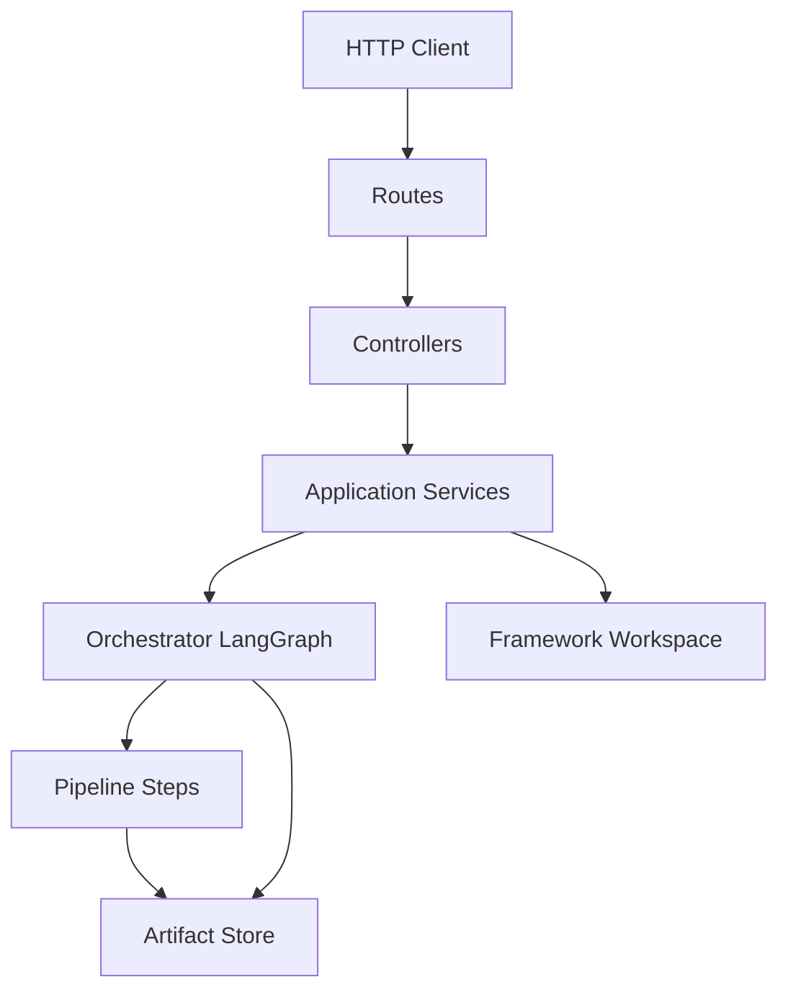

# Automation Agent — Build Prompt (Cursor / AI)

**Use this file** when implementing the **automation-agent** service.  
**Do not** paste or re-read the full LLD on every task — follow this prompt and open the LLD only for artifact schemas and step details.

| Document | Purpose |
|----------|---------|
| **This file** | How to build: layers, SOLID, phases, do/don’t |
| [`AUTOMATION_AGENT_OVERVIEW.md`](./AUTOMATION_AGENT_OVERVIEW.md) | Architecture summary for humans |
| [`AUTOMATION_AGENT_LLD.md`](./AUTOMATION_AGENT_LLD.md) | Full specs, JSON contracts, acceptance gates (§21) |

**Repos:** `automation-agent` = platform you build. `pw-api-framework` = synced target (Git workspace).

---

## 1. How to use with Cursor

1. Start every session with: **“Follow `docs/AUTOMATION_AGENT_BUILD_PROMPT.md`. Implement only Phase \<X\>.”**
2. Implement **one phase at a time**. Do not skip ahead.
3. After each phase, run that phase’s **exit checks** before continuing.
4. For artifact field names and pipeline logic, read **only** the LLD section cited for that phase.
5. Prefer **small PR-sized diffs** — one layer or one pipeline step per change when possible.

Optional: add a Cursor rule pointing to this file for the `automation-agent` repo root.

---

## 2. Non-negotiable rules

| Rule | Detail |
|------|--------|
| Deterministic first | Parsers, graphs, templates before LLM |
| LLM only for gaps | Unparsed English rules (5g), custom asserts (12) — never bulk TS codegen |
| No logic in routes | Routes register HTTP; controllers delegate |
| No Git in pipelines | Only `GitService` touches Git |
| Stateless pipeline nodes | Inputs/outputs = JSON artifacts; state in store + LangGraph checkpointer |
| `repoRoot` | Always resolved `FRAMEWORK_WORKSPACE_DIR` after framework is `ready` |
| Fail closed | Low mapping rate, missing framework sync, schema errors → stop run with clear error |
| Monolithic modular | One deployable app; swap plugins (rate limit, Kafka) later without rewriting core |
| SOLID | See §4 — enforce on every new file |

---

## 3. Layered architecture

### 3.1 Request flow



### 3.2 Layer responsibilities

| Layer | Path | May do | Must not do |
|-------|------|--------|-------------|
| **Composition root** | `src/app.ts` | Wire DI, register plugins, `initOnStartup()` | Business rules, parsing |
| **Config** | `src/config/*.ts` | Read/validate env, export typed config | I/O, HTTP, pipeline logic |
| **Routes** | `src/routes/*.route.ts` | Path, method, schema binding, attach controller | `if/else` business logic, DB/Git calls |
| **Controllers** | `src/controllers/*.controller.ts` | Validate DTO, call one service method, map status codes | Multi-step orchestration, LangGraph, file writes |
| **Application services** | `src/services/**` | Use cases: git sync, framework refresh, start run, load artifacts | HTTP types, Fastify `reply` |
| **Orchestrator** | `src/orchestrator/**` | LangGraph graph, edges, node registration | Parse Postman, generate TS |
| **Pipeline steps** | `src/pipelines/<domain>/**` | Pure transform: input artifact(s) → output artifact(s) | HTTP, Git, global mutable singletons |
| **Contracts** | `src/contracts/**` | JSON Schema / Zod for artifacts | Runtime orchestration |
| **Ports (interfaces)** | `src/ports/**` | `IGitService`, `IArtifactStore`, `ILLMClient`, `IEventBus` | Implementations |
| **Infrastructure** | `src/infrastructure/**` | FS artifact store, LLM adapter, logger | Domain rules |
| **Plugins** | `src/plugins/**` | Rate limit, metrics hooks (stubs in V1) | Pipeline business logic |

### 3.3 Target folder tree

```
automation-agent/
├── src/
│   ├── app.ts
│   ├── config/
│   ├── routes/
│   ├── controllers/
│   ├── services/
│   │   ├── git/
│   │   ├── framework-intelligence/
│   │   └── runs/                    # run lifecycle (later phases)
│   ├── ports/
│   ├── infrastructure/
│   │   ├── artifact-store/
│   │   └── llm/
│   ├── orchestrator/
│   │   ├── graph.ts
│   │   ├── state.ts
│   │   └── nodes/
│   ├── pipelines/
│   │   ├── ingest/                  # 1b, 2, 3, 3d
│   │   ├── linker/                  # 2m → 04
│   │   ├── rules/                   # 5d, 5g, 6
│   │   ├── planner/                 # 7
│   │   ├── codegen/                 # 9–13
│   │   └── validate/                # 15, 17
│   ├── contracts/
│   └── plugins/
├── tests/
│   ├── unit/
│   └── integration/
└── .env.example
```

### 3.4 Naming conventions

| Kind | Pattern | Example |
|------|---------|---------|
| Route file | `*.route.ts` | `framework.route.ts` |
| Controller | `*.controller.ts` | `framework.controller.ts` |
| Service | `*.service.ts` | `git.service.ts` |
| Port | `I*.ts` | `IGitService.ts` |
| Pipeline step | `step-<id>.ts` or `step<Id>.ts` | `step-2m-link-journey.ts` |
| LangGraph node | thin wrapper calling one pipeline step | `nodes/linkJourney.node.ts` |
| Artifact file | LLD names | `04-journey-spec.json` |

---

## 4. SOLID (enforce on every change)

| Principle | Practice in this project |
|-----------|---------------------------|
| **S** | `GitService` = sync only. `FrameworkIntelligenceService` = refresh + readiness. Each pipeline file = one step. |
| **O** | New transport (Kafka) = new plugin/consumer implementing `IRunQueue`; do not edit pipeline steps. |
| **L** | All `IGitService` implementations honor `sync()` contract; tests use fakes implementing same port. |
| **I** | Split ports: `IGitService`, `IArtifactStore`, `ILLMClient` — no mega `IPlatform`. |
| **D** | Controllers depend on service **interfaces**; `app.ts` binds concrete classes. |

**Dependency direction (allowed imports):**

```
routes → controllers → services → ports ← infrastructure
orchestrator → pipelines → contracts
pipelines → contracts, ports (LLM/store only when needed)
```

**Forbidden:** `pipelines/*` importing `routes/*`, `controllers/*`, or `fastify`.

---

## 5. Phase-by-phase build instructions

Implement **only** the active phase. LLD acceptance details: **§21**.

### Phase P-platform — Platform + Git sync

**Goal:** Fastify app connected to pw-api-framework workspace.

**Build:**

| File | Responsibility |
|------|----------------|
| `config/framework.config.ts` | Env: `FRAMEWORK_GIT_URL`, `BRANCH`, `WORKSPACE_DIR`, `TOKEN`, `REFRESH_ON_START` |
| `ports/IGitService.ts` | `sync()`, `getStatus()` |
| `services/git/git.service.ts` | Clone or pull+hard-reset; PAT in HTTPS URL (V1) |
| `services/framework-intelligence/frameworkIntelligence.service.ts` | `initOnStartup()`, `runRefresh()`, `getStatus()` |
| `controllers/framework.controller.ts` | `refresh`, `status` |
| `routes/framework.route.ts` | `POST /api/framework/refresh`, `GET /api/framework/status` |
| `app.ts` | Register routes, bind services, call `initOnStartup()` |

**Exit checks:**

- [ ] Status returns `ready: true` after successful sync
- [ ] Refresh updates `commitSha`
- [ ] No business logic inside route handlers
- [ ] Unit tests for `GitService` with temp dir (mock fs/git where needed)

**LLD:** §0, §0.1, §21.0

---

### Phase P0a — LangGraph shell

**Goal:** Runnable graph with stub nodes and artifact paths.

**Build:**

- `orchestrator/state.ts` — run state: `runId`, `productId`, `repoRoot`, `artifacts`, `errors`
- `orchestrator/graph.ts` — `StateGraph`, conditional edges (stub implementations OK)
- `infrastructure/artifact-store/` — read/write under `runs/{runId}/`
- `services/runs/run.service.ts` — create run, invoke graph
- `controllers/runs.controller.ts` + `routes/runs.route.ts` — `POST /api/runs` (minimal body)

**Exit checks:**

- [ ] Graph executes start → end with empty/stub artifacts
- [ ] `repoRoot` rejected if framework not `ready`

**LLD:** §4 (LangGraph), §18 P0a

---

### Phase P0 — Ingest + linker (1b, 2, 2m → 04)

**Build pipeline modules only** (no HTTP changes required unless exposing run inputs):

- `pipelines/ingest/` — manual TC, Postman, OpenAPI → `01b`, `02`, `02b`, `02c`
- `pipelines/linker/` — `2m` → `04-journey-spec.json` using `api-aliases.json`
- Wire LangGraph nodes: `ingest_*`, `link_journey`

**Exit checks:**

- [ ] Golden fixtures produce stable `04` with `mappingRate >= 0.95` on CCBP sample
- [ ] Unmapped steps listed in `04.unmapped[]`

**LLD:** Steps 1b, 2, 2m; §21.1–21.3

---

### Phase P1 — Repo index + rules (3, 5d, 6, 11)

- `pipelines/ingest/step-3-repo-index.ts` — scans `repoRoot`
- `pipelines/rules/` — `5d`, `6`, assertion catalog usage
- Outputs: `03`, `05`, `06`

**Exit checks:** §21.4–21.5 in LLD

---

### Phase P2 — API + service codegen (9, 10)

- `pipelines/codegen/` — deterministic TS writers only
- Writes under synced workspace paths per LLD

**Exit checks:** generated files compile; no duplicate symbols

---

### Phase P3 — Journey + spec (7, 13)

- `pipelines/planner/`, journey + spec codegen
- Match patterns in pw-api-framework `tests/integration/bbps/ccbp/`

**LLD:** §19 reference patterns

---

### Phase P4+ — Incremental, custom asserts, vector, validate

Follow **§18** and **§21.6+** in LLD. Do not implement P5 vector until P0–P4 are green.

---

## 6. Controller pattern (Fastify)

Routes stay thin. Example shape:

```typescript
// routes/framework.route.ts — register only
app.post('/api/framework/refresh', (req, reply) =>
  frameworkController.refresh(req, reply));

// controllers/framework.controller.ts
export class FrameworkController {
  constructor(private readonly frameworkIntel: IFrameworkIntelligenceService) {}

  async refresh(_req: FastifyRequest, reply: FastifyReply) {
    const result = await this.frameworkIntel.runRefresh();
    return reply.code(result.success ? 200 : 503).send(result);
  }
}
```

---

## 7. Pipeline step pattern

Each step is a **pure function** (or class with one `execute`):

```typescript
export async function step2mLinkJourney(input: {
  manualCases: ManualTestCasesArtifact;
  apiContracts: ApiContractsArtifact;
  aliases: ApiAliasesConfig;
}): Promise<JourneySpecArtifact> {
  // deterministic only — no fetch, no LLM
}
```

LangGraph node = wrapper:

```typescript
export async function linkJourneyNode(state: RunState): Promise<Partial<RunState>> {
  const out = await step2mLinkJourney({ ...load from state.artifacts });
  return { artifacts: { ...state.artifacts, '04-journey-spec': out } };
}
```

---

## 8. Testing expectations

| Layer | Test type |
|-------|-----------|
| Pipeline steps | Unit tests with golden JSON fixtures |
| Services | Unit tests with mocked ports |
| Controllers | Light tests — mock service, assert status/body |
| Git sync | Integration test with temp directory |
| End-to-end | One product slice (e.g. CCBP bill-fetch) per major phase |

---

## 9. Anti-patterns (reject in review)

- LLM generating full service or journey files
- `fetch` / `axios` inside `pipelines/*` (except explicit ingest adapters in `ingest/`)
- Storing pipeline logic in `app.ts`
- Skipping `04.unmapped` or silent API guess when mapping fails
- Hardcoding paths outside `repoRoot` / workspace config
- God class `AutomationService` doing Git + ingest + codegen
- Multi-agent LLM crews — use **one** LangGraph workflow only

---

## 10. Future scale (stubs only in V1)

| Feature | Where it goes later | V1 action |
|---------|---------------------|-----------|
| Rate limiting | `plugins/rate-limit.ts` | Empty plugin register in `app.ts` |
| Kafka jobs | `plugins/kafka-consumer.ts` + `IRunQueue` | Port + no-op impl |
| Multi-instance | Shared artifact store + lock port | Local FS store OK |

Do not implement Kafka/rate-limit until core pipeline phases pass exit checks.

---

## 11. Quick reference — artifact → step

| Artifact | Step | LLM? |
|----------|------|------|
| `01b` | 1b | No |
| `02`, `02b`, `02c` | 2 | No |
| `04-journey-spec` | 2m | No |
| `03`, `03d` | 3, 3d | No |
| `05` | 5d, 5g | 5g only |
| `06` | 6 | Rare |
| `07` | 7 | Mostly no |
| TS outputs | 9–13 | 12 only |

Full schemas: **LLD** body sections per step.

---

## 12. Session starter templates (copy-paste)

**Phase P-platform:**

```
Implement automation-agent Phase P-platform per docs/AUTOMATION_AGENT_BUILD_PROMPT.md.
Layers: config, ports, git service, framework-intelligence service, controller, routes, app.ts.
LLD acceptance: §21.0 only. No pipeline or LangGraph yet.
```

**Phase P0 ingest:**

```
Implement Phase P0 per BUILD_PROMPT: pipelines/ingest + pipelines/linker + LangGraph nodes.
Deterministic only. Use LLD for 01b, 02, 2m, 04 schemas. Tests with golden fixtures.
```

---

*Version: 1.0 — aligned with LLD v3.2*
